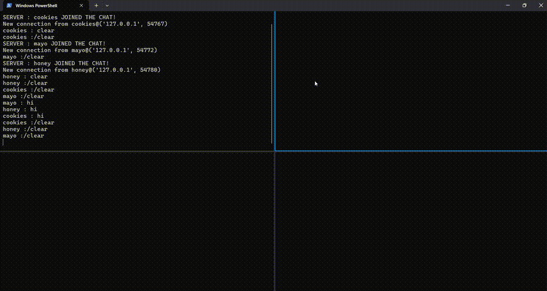

# simplechat - LAN-Based CLI Chatroom



A simple realtime chatroom built in python.

## Commands

| Command         | Description                          |
|-----------------|--------------------------------------|
| `/exit`         | Disconnect from chat                 |
| `/list`         | Show connected users                 |
| `/help`         | Display command help                 |
| `/kick <user>`  | Remove a user from chat. Admin previlages required              |
| `/whisper <user>` | Send private message               |
| `/clear`        | Clear chat history                   |
| `/help`         | Get a list of available commands.    |

## Installation

**Requirements:**

- Python 3.6+
- Network access between machines

```bash
git clone https://github.com/trimpta/simplechat.git
cd simplechat
```

## Usage

### Server Setup

1. Start the chat server and file server:

```bash
python serve_client.py
```

### Client Connection

Run **one** of these commands in any terminal:

**Linux:**

```bash
wget http://<server-ip>:8000/client.py && python3 client.py
```

**Windows:**

```powershell
curl http://<server-ip>:8000/client.py -o client.py && python client.py
```

Replace `<server-ip>` with the host machine's local IP address.

## Security Notice

This is a **proof-of-concept** system designed for trusted local networks:

- No message encryption
- Basic admin controls
- Plaintext communication
- Not recommended for internet exposure

## Troubleshooting

**Common Issues:**

1. **Connection Failed**
   - Verify server IP address
   - Check firewall settings:

   ```bash
   sudo ufw allow 5906:5907/tcp
   sudo ufw allow 8000/tcp
   ```

2. **Username Errors**
   - Use 3-20 characters
   - Valid formats: letters, numbers, (- _ .)

3. **Stuck Messages**
   - Try Restarting client and/or server
